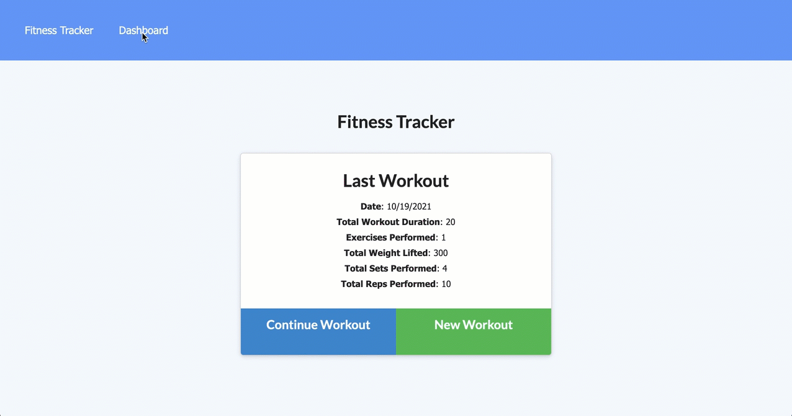

# workout-tracker
## Description
A simple tech blog using Model View Controller (MVC) paradigm. Built using MySQL2, Express, Sequelize, bcrypt, Session, Handlebars, Bootstrap and dotenv.

Repository: 
    https://github.com/mingmanhk/workout-tracker

Deployment:
    https://victor-tech-blog.herokuapp.com
     
Demo
    

## Table of Contents
1. [Installation](#installation)

2. [Usage](#usage)

3. [Credits](#credits)

4. [License](#license)

5. [Features](#features)

6. [Contribute](#contribute)

7. [Questions](#questions)

## Installation
    1. Run npm install to install all dependencies
    2. Run npm run seed to add sample data

## Usage
   1. Open terminal
   2. Run 'npm start'
   3. Open http://localhost:3000/ from browser
   
## Credits
Victor Lam

## License

## Features
This application provided following functionality:

    * Add exercises to the most recent workout plan.
    * Add new exercises to a new workout plan.
    * View the combined weight of multiple exercises from the past seven workouts on the stats page.
    * View the total duration of each workout from the past seven workouts on the stats page.

## Contribute
Victor Lam

## Questions
Questions about this repository? Please contact me at [mingmanhk@gmail.com](mailto:mingmanhk@gmail.com).
View more of my work in GitHub at [mingmanhk](https://github.com/mingmanhk)